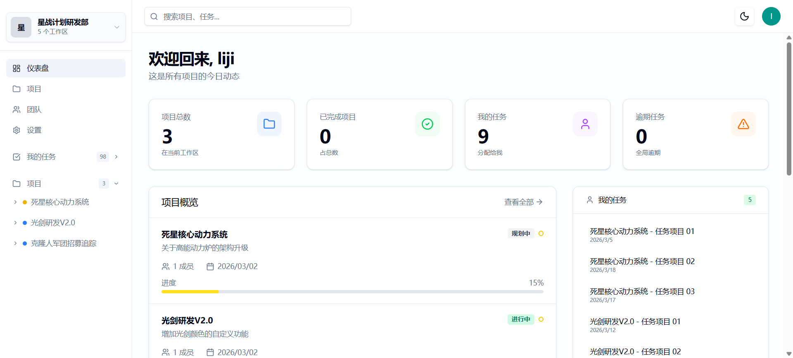
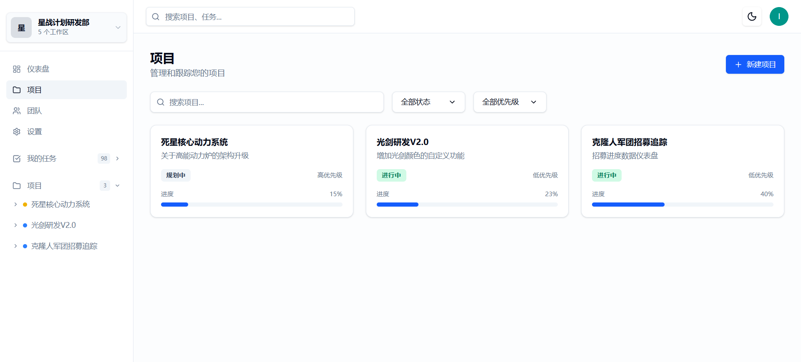
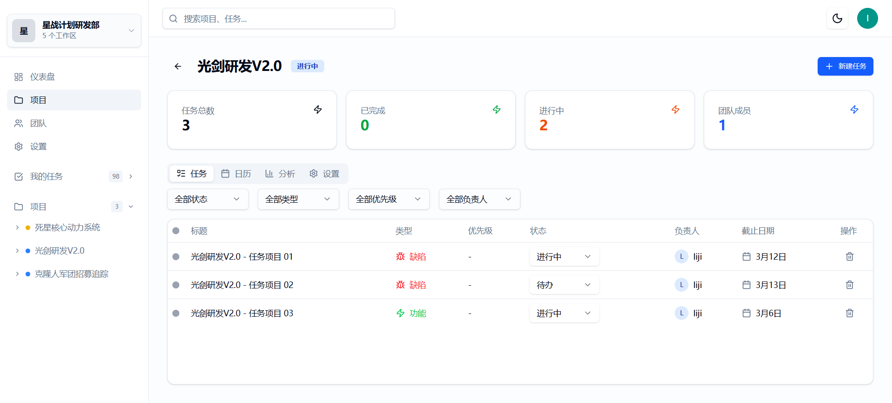
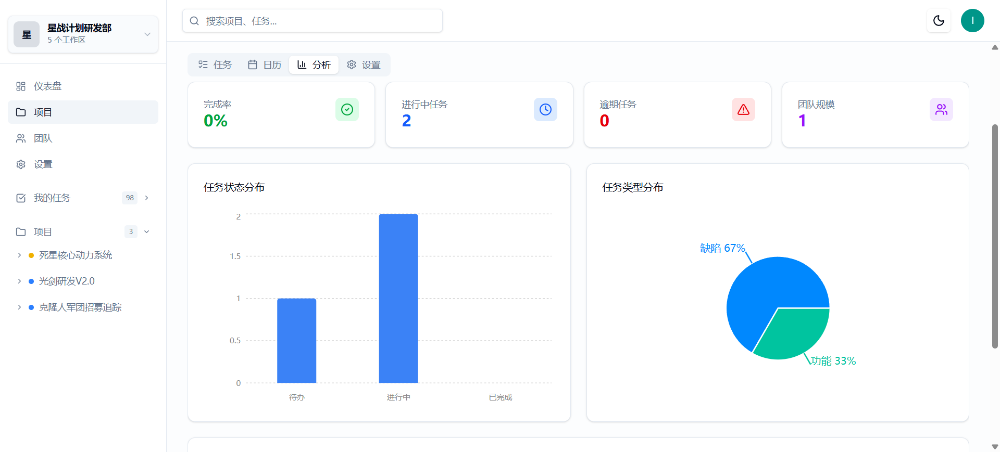

# 🚀 PMS (Project Management System) - 全栈项目管理系统

一个生产级别的全栈项目管理系统，旨在提供高效的团队协作与任务管理体验。本项目采用现代化的前后端分离架构，基于 **pnpm Monorepo** 进行工程化管理，涵盖了从数据库建模、RESTful API 开发、交互式前端界面到全链路自动化测试的完整生命周期。

## ✨ 核心特性

- **🚦 沉浸式敏捷工作流**: 支持直观的可视化看板（Kanban），轻松实现任务的创建、分配、拖拽流转与状态追踪。
- **📊 多维数据聚合看板**: 基于 `Recharts` 分析并可视化项目与任务进度，关键指标一目了然。
- **🔐 健壮的现代身份验证**: 深度集成 `Better Auth`，包含完整的注册、登录、密码重置、邮箱验证等核心安全链路。
- **🏢 组织与团队治理**: 原生支持多租户/团队（Organizations）架构，可对成员进行多维度协作管理。
- **🛡️ 极致的全栈类型安全**: 基于 `TypeScript` 及 `Zod` 生态，实现前后端接口定义的完全解耦与数据校验，保障极佳的开发者体验及系统稳定性。

---

## 🛠 技术栈与架构

本项目采用了当前 Web 时代成熟且高性能的技术选型：

### 🏗 架构与工程化

- **[pnpm Workspaces](https://pnpm.io/)**: Monorepo 策略，保证代码的高度复用与一致的依赖管理。
- **[ESLint](https://eslint.org/) / [Prettier](https://prettier.io/)**: 保障代码的极致规范与优雅。

### 💻 前端应用 (Web)

位于 `apps/web` 目录下，专注于打造丝滑、响应式的用户交互体验。

- **核心框架**: React 19 + Vite 6
- **样式与组件库**: Tailwind CSS v4 + Radix UI (无头组件库)
- **状态管理**: Redux Toolkit (全局状态) + React Query (异步状态/服务端缓存)
- **路由管理**: React Router DOM v7
- **可视化**: Recharts

### ⚙️ 后端应用 (API)

位于 `apps/api` 目录下，构建了一个轻量、极速且类型安全的后端服务。

- **核心框架**: Hono.js + Node.js
- **ORM 与数据库**: Drizzle ORM + PostgreSQL
- **认证与安全**: Better Auth
- **数据流验证**: Zod

### 🧪 质量保障与测试体系

本项目高度重视代码的健壮性与可维护性，实现了多维度的测试覆盖：

- **单元/集成测试**: 基于 `Vitest` 构建高覆盖率的核心逻辑及组件测试。
- **前端数据解耦**: 采用 `MSW (Mock Service Worker)` 为前端提供隔离的 API 拦截与模拟环境。
- **端到端测试体系 (E2E)**: 使用 `Playwright` 针对核心业务逻辑（如登录登出、跨页面交互）进行自动化 UI 验收测试。

---

## 📂 项目结构

```text
pms/
├── apps/
│   ├── api/          # 后端服务中心 (Hono + Drizzle + PostgreSQL)
│   │   ├── src/
│   │   │   ├── db/       # Drizzle schema 与数据库连接
│   │   │   ├── routes/   # 模块化路由编排 (Users, Projects, Tasks, etc.)
│   │   │   └── lib/      # 工具类、集成组件
│   └── web/          # 前端应用中心 (React + Vite)
│       ├── src/
│       │   ├── components/ # 共享的高级/基础 UI 组件
│       │   ├── pages/      # 核心页面视图 (Dashboard, Board, Auth)
│       │   ├── store/      # 状态池
│       │   └── lib/        # API Request, Utils
├── e2e/              # Playwright 完整的端到端测试用例群
├── package.json      # 全局工作区配置与脚本
└── pnpm-workspace.yaml
```

---

## 🚀 本地运行与部署

### 1. 环境准备

请确保您本地已经安装了以下环境：

- [Node.js](https://nodejs.org/) (推荐 >= 20.x)
- [pnpm](https://pnpm.io/) (>= 9.x)
- [PostgreSQL](https://www.postgresql.org/) (本地或云端实例)

### 2. 克隆与依赖安装

```bash
git clone <your-repository-url>
cd pms
pnpm install
```

### 3. 环境变量配置

在 `apps/api` 和 `apps/web` 目录下配置相应的环境变量文件：

- 复制 `.env.example` 为 `.env`
- 完善数据库连接 URI 及相关 Auth 密钥等配置。

### 4. 数据库初始化

```bash
# 运行 Drizzle 数据库同步/迁移
cd apps/api
pnpm db:push # 或者使用您项目中相对应的数据库迁移命令
# 如果有的话，您可以执行您编写好的数据填充脚本（seed）
```

### 5. 一键启动项目

在项目根目录运行即可并发启动前后端服务：

```bash
pnpm dev
# - 前端项目默认运行在: http://localhost:5173
# - 后端接口默认运行在: http://localhost:3100
```

---

## 📸 界面预览

_(请在此处替换为您项目的实际截图，以提升文档的直观吸引力)_

|  |  |
| :-----------------------------------: | :-------------------------------: |
|          **全景 Dashboard**           |        **项目与进度追踪**         |

|  |  |
| :----------------------------------: | :---------------------------------: |
|          **敏捷看板工作流**          |       **多维属性与详情管理**        |

---

## 📄 开源协议

本项目采用 [MIT License](LICENSE) 协议开源。
